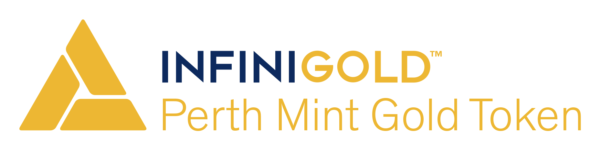

The Perth Mint Gold Token (PMGT) is an ERC20 compliant token, each representing 1 fine troy ounce of physical gold
securely stored in The Perth Mint's central bank grade vaults.

Developed by InfiniGold, the tokens are 100% backed by GoldPass certificates issued by The Perth Mint, the world's
largest refiner of newly mined gold.  Every ounce of gold is guaranteed by the highly rated sovereign entity - the
Government of Western Australia.

See the [PMGT whitepaper](https://pmgt.io/static/assets/pmgt_whitepaper.pdf) for more information.

# Contract Addresses

| Contract  | Ethereum Address                                                                                                      |
| --------- | --------------------------------------------------------------------------------------------------------------------- |
| PMGT      | [0xAFFCDd96531bCd66faED95FC61e443D08F79eFEf](https://etherscan.io/token/0xaffcdd96531bcd66faed95fc61e443d08f79efef)   |
| Blacklist | [0xdE40A3c26F3af423E0d0EcC30ead42B140E16B51](https://etherscan.io/address/0xdE40A3c26F3af423E0d0EcC30ead42B140E16B51) |
| Whitelist | [0x21860dE6d3ba2fAC843f6864a0FAE8e97387bF66](https://etherscan.io/address/0x21860dE6d3ba2fAC843f6864a0FAE8e97387bF66) |

# Links

| Name               | URL                                     |
| ------------------ | --------------------------------------- |
| PMGT Website       | https://pmgt.io                         |
| InfiniGold Website | https://infinigold.com                  |
| Realtime Audit     | https://pmgt.perthmint.com              |
| Twitter            | https://twitter.com/pmgoldtoken         |
| Telegram           | https://t.me/pmgoldtoken                |
| Medium             | https://medium.com/pmgt                 |
| Reddit             | https://reddit.com/r/pmgoldtoken        |
| LinkedIn           | https://linkedin.com/company/infinigold |
| Facebook           | https://facebook.com/pmgoldtoken        |

# License

The PMGT smart contract code in this repository is released under the [MIT License](./LICENSE).

## OpenZeppelin Licenses

This repository also contains contains Solidity smart contract code developed by
[OpenZeppelin](https://openzeppelin.com/). To ensure compliance with their copyright, copied and modified code has been
referenced below with links to OpenZeppelin's own open-source MIT licenses.

The [upgradeable proxy contracts](./contracts/upgradeability) are based on code released under this
[ZeppelinOS LICENSE](https://github.com/OpenZeppelin/openzeppelin-sdk/blob/v2.2.0/LICENSE).

The [access role contracts](./contracts/access), [lifecycle contracts](./contracts/lifecycle),
[SafeMath.sol contract](./contracts/math/SafeMath.sol), base [ERC20 contracts](./contracts/token) and
[Address.sol contract](./contracts/utils/Address.sol) are  based on code released under this
[OpenZeppelin Contracts LICENSE](https://github.com/OpenZeppelin/openzeppelin-contracts/blob/v2.2.0/LICENSE).
